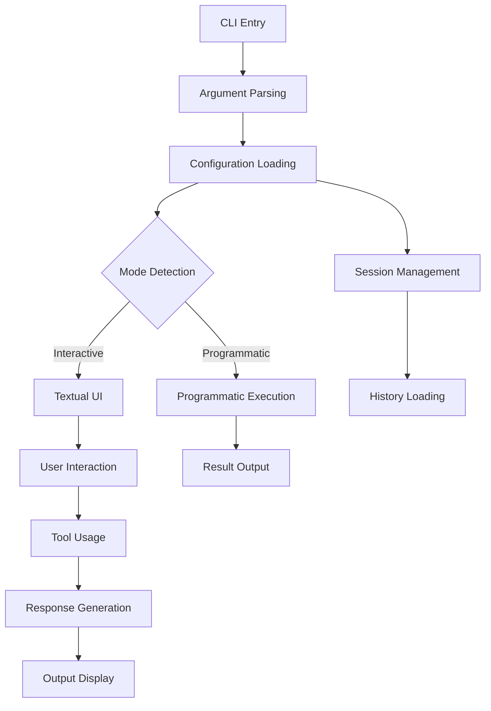

# Mistral Vibe CLI - Components Documentation

## Overview

The Mistral Vibe CLI is composed of several key components that work together to provide a powerful, interactive coding assistant. These components handle everything from argument parsing to session management and user interface.

## 1. CLI Entrypoint (cli.py)

**Location**: `/vibe/cli/cli.py`

**Purpose**: Main entry point and orchestration for the Vibe CLI.

### Key Functions:

#### `get_initial_mode(args: argparse.Namespace) -> AgentMode`
Determines the initial operating mode based on command line arguments:
- `--plan`: AgentMode.PLAN
- `--auto-approve`: AgentMode.AUTO_APPROVE
- `--prompt` provided: AgentMode.AUTO_APPROVE
- Default: AgentMode.DEFAULT

#### `get_prompt_from_stdin() -> str | None`
Reads prompt from standard input if available:
- Checks if stdin is a TTY
- Reads and strips content
- Handles KeyboardInterrupt and OSError gracefully
- Restores TTY if content was read

#### `load_config_or_exit(agent: str | None, mode: AgentMode) -> VibeConfig`
Loads configuration with error handling:
- Handles MissingAPIKeyError by running onboarding
- Handles MissingPromptFileError with user-friendly message
- Handles ValueError with appropriate error display
- Exits with status 1 on errors

#### `bootstrap_config_files() -> None`
Ensures essential configuration files exist:
- Creates default config file if missing
- Creates instructions file if missing
- Creates history file with initial content if missing
- Handles errors gracefully with user messages

#### `load_session(args: argparse.Namespace, config: VibeConfig) -> list[LLMMessage] | None`
Loads previous sessions for continuation:
- Handles `--continue_session` and `--resume` arguments
- Validates session logging is enabled
- Finds latest session or specific session by ID
- Loads messages from found session
- Provides user-friendly error messages

#### `run_cli(args: argparse.Namespace) -> None`
Main CLI execution function:
- Loads API keys from environment
- Handles `--setup` argument for onboarding
- Bootstraps configuration files
- Determines initial mode
- Loads configuration
- Handles enabled tools from arguments
- Loads session if requested
- Processes programmatic mode with `--prompt`
- Runs textual UI for interactive mode
- Handles KeyboardInterrupt and EOFError gracefully

### Workflow:
1. **Initialization**: Load API keys, handle setup requests
2. **Configuration**: Bootstrap files, load config, determine mode
3. **Session Management**: Load previous sessions if requested
4. **Execution**: Run programmatic or interactive mode
5. **Cleanup**: Handle interruptions gracefully

## 2. Configuration System

**Location**: `/vibe/core/config.py`

**Purpose**: Manage all configuration aspects of the Vibe CLI.

### Key Components:

#### VibeConfig Class
- Central configuration management
- Loading and saving configurations
- Agent-specific configurations
- Mode-specific overrides

#### Configuration Files
- **Main Config**: User preferences and settings
- **Instructions**: Agent behavior guidelines
- **History**: Conversation history
- **API Keys**: Authentication credentials

### Features:
- Environment variable integration
- File-based configuration
- Validation and error handling
- Default configuration generation
- Agent-specific profiles

## 3. Session and History Management

**Location**: `/vibe/core/interaction_logger.py`

**Purpose**: Track and manage conversation sessions.

### Key Features:

#### InteractionLogger Class
- Session creation and management
- Message logging and retrieval
- Session metadata tracking
- Search and filtering capabilities

#### Session Features
- **Session Continuation**: `--continue_session` for latest session
- **Specific Session**: `--resume <id>` for specific session
- **Session Storage**: Configurable save directories
- **Message History**: Full conversation context

### Usage Patterns:
- Automatic session logging when enabled
- Manual session management via CLI arguments
- Session metadata for organization
- Search functionality for finding specific sessions

## 4. Textual UI

**Location**: `/vibe/cli/textual_ui/`

**Purpose**: Provide interactive user interface for the CLI.

### Key Components:

#### App Structure
- Main application class
- UI layout and components
- Input handling and processing
- Output display and formatting

#### Features
- **Rich Text**: Colorized and formatted output
- **Interactive Input**: Real-time user interaction
- **Context Display**: Show relevant project information
- **Tool Integration**: Seamless tool usage
- **Error Handling**: User-friendly error display

### UI Components:
- Input area for user prompts
- Output area for agent responses
- Status indicators
- Context display
- Tool usage visualization

## 5. Programmatic Mode

**Location**: `/vibe/core/programmatic.py`

**Purpose**: Enable automated, non-interactive usage.

### Key Features:

#### run_programmatic Function
- Non-interactive execution
- Prompt processing
- Response generation
- Output formatting

#### Parameters:
- `config`: VibeConfig instance
- `prompt`: User prompt string
- `max_turns`: Conversation limit
- `max_price`: Cost limit
- `output_format`: Response format (text, json, etc.)
- `previous_messages`: Conversation history
- `mode`: AgentMode for behavior

### Use Cases:
- CI/CD integration
- Scripted automation
- Batch processing
- API-like usage

### Output Formats:
- **Text**: Human-readable format
- **JSON**: Structured data format
- **Compact**: Summary format
- **Custom**: User-defined formats

## 6. Argument Parsing

**Location**: `/vibe/cli/commands.py`

**Purpose**: Handle command line arguments and options.

### Key Arguments:

#### Mode Selection
- `--plan`: Planning mode
- `--auto-approve`: Automatic execution mode
- `--prompt`: Programmatic mode with prompt

#### Session Management
- `--continue-session`: Continue latest session
- `--resume <id>`: Resume specific session

#### Configuration
- `--agent <name>`: Use specific agent profile
- `--enabled-tools`: Specify enabled tools

#### Execution Control
- `--max-turns`: Limit conversation turns
- `--max-price`: Limit execution cost
- `--output`: Specify output format

#### Setup
- `--setup`: Run onboarding setup

## 7. Additional Components

### Autocompletion System
**Location**: `/vibe/cli/autocompletion/`

- Command completion
- Argument suggestions
- Interactive help

### Update Notifier
**Location**: `/vibe/cli/update_notifier/`

- Version checking
- Update notifications
- Changelog display

### Terminal Setup
**Location**: `/vibe/cli/terminal_setup.py`

- Terminal configuration
- Environment setup
- Compatibility handling

### History Manager
**Location**: `/vibe/cli/history_manager.py`

- Conversation history
- Command history
- Navigation features

### Clipboard Integration
**Location**: `/vibe/cli/clipboard.py`

- Copy/paste functionality
- System clipboard access
- Content sharing

## Component Interaction Flow

## Best Practices for Component Usage

### Configuration
- Use agent profiles for different workflows
- Leverage environment variables for secrets
- Validate configuration before execution
- Handle missing configuration gracefully

### Session Management
- Enable session logging for continuity
- Use descriptive session names
- Clean up old sessions periodically
- Handle session errors gracefully

### UI Interaction
- Provide clear user guidance
- Handle interruptions gracefully
- Display relevant context information
- Format output for readability

### Programmatic Usage
- Set appropriate limits (turns, price)
- Handle errors and exceptions
- Use proper output formatting
- Provide meaningful error messages

### Tool Integration
- Follow tool-specific best practices
- Handle tool errors appropriately
- Provide user feedback on tool usage
- Respect tool safety guidelines

## Advanced Usage Patterns

### Multi-Agent Workflows
- Use different agent profiles for different tasks
- Switch agents based on workflow phase
- Leverage agent-specific configurations

### Session Continuation
- Use `--continue-session` for seamless workflows
- Resume specific sessions with `--resume <id>`
- Manage session lifecycle appropriately

### Automated Workflows
- Use programmatic mode for CI/CD integration
- Script complex workflows
- Handle automation errors gracefully

### Custom Configuration
- Extend configuration for custom needs
- Add custom agent profiles
- Modify default behaviors

## Troubleshooting Component Issues

### Configuration Problems
- Check file permissions
- Validate configuration syntax
- Verify environment variables
- Review error messages carefully

### Session Issues
- Check session logging enabled
- Verify session directory exists
- Validate session IDs
- Handle corrupted sessions

### UI Problems
- Check terminal compatibility
- Verify dependencies
- Test with different terminals
- Review UI configuration

### Execution Errors
- Check tool availability
- Validate input parameters
- Review error messages
- Test with simpler prompts